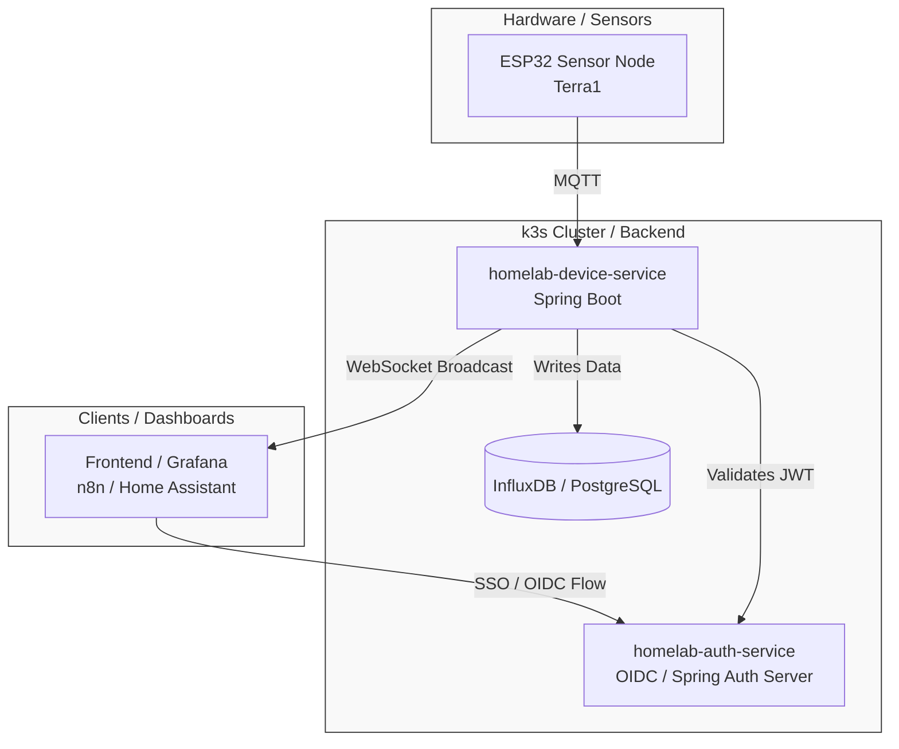

# Hi, I'm Dominic 👋

Software engineer with a background spanning embedded systems, enterprise Java, and mission-critical financial software. I bridge the gap between hardware and the cloud—from writing microcontroller firmware to deploying OIDC-secured microservices on a self-hosted Kubernetes cluster.

Currently studying **B.Sc. Software Systems** at the University of Zurich, with a minor in Business Administration.

---

## 🔌 What I Build

My main focus is **IoT systems**—end-to-end, from the sensor to the dashboard. 

The *Terra* project line is my long-running thread: an ESP32 sensor node reads environmental data, publishes it over MQTT, and feeds into a Spring Boot backend. I am currently evolving my original 2024 monolith into a robust homelab platform featuring OIDC SSO, real-time device services, and a `k3s` cluster running on mixed hardware (Raspberry Pi + MacBook). 

> *Infrastructure backbone: Ansible | Longhorn | Cloudflare Tunnel | Flux CD*

---

## 🛠 Tech Stack

* **Backend & Embedded:** `Java 21` `Spring Boot` `Spring Authorization Server` `C++` `Python` `COBOL` `PlatformIO`
* **IoT & Protocols:** `ESP32` `MQTT` `OIDC` `OAuth 2.1` `JWT` `REST` `WebSocket / STOMP`
* **DevOps & Infrastructure:** `k3s` `Ansible` `Longhorn` `cert-manager` `Traefik` `Cloudflare Tunnel` `Flux CD` `GitHub Actions` `Docker`
* **Databases & Observability:** `PostgreSQL` `InfluxDB` `MySQL` `DB2` `Prometheus` `Grafana`

---

## 📌 Featured Projects

### 🏠 [homelab](https://github.com/doemefu/homelab) 
> **IaC for a Mixed-Arch k3s Cluster**

Ansible-driven infrastructure for a heterogeneous homelab: Raspberry Pi 4/5 (arm64) + MacBook Airs (amd64) running `k3s`. Features Longhorn for persistent storage, cert-manager + Traefik for TLS, Cloudflare Tunnel for external access, and kube-prometheus-stack for observability. Secrets are managed via SOPS + age, and app deployments via Flux CD.
* **Tech:** `Ansible` `k3s` `Longhorn` `Traefik` `Flux CD` `SOPS` `Cloudflare Tunnel`

### 🔐 [homelab-auth-service](https://github.com/doemefu/homelab-auth-service) 
> **OIDC Identity Provider**

A Spring Authorization Server acting as the SSO gateway for everything in the homelab (Grafana, Home Assistant, n8n, custom services). Implements Authorization Code Flow with PKCE, JWKS for downstream validation, role-based access control, and scheduled purging of expired authorizations. 
* **Tech:** `Java 21` `Spring Auth Server` `OIDC` `PKCE` `PostgreSQL`

### 📡 [homelab-device-service](https://github.com/doemefu/homelab-device-service) 
> **Real-Time IoT Device Service**

The MQTT-facing core of the platform. Subscribes to sensor topics, persists device state in PostgreSQL, writes sensor data to InfluxDB, runs scheduled MQTT commands (automations), and broadcasts live state to the frontend via STOMP/WebSocket. Validates JWTs against the auth-service JWKS.
* **Tech:** `Java 21` `Spring Boot` `MQTT` `InfluxDB` `WebSocket` `PostgreSQL`

### 🌱 [Terra1](https://github.com/doemefu/Terra1)
> **ESP32 Sensor Node Firmware**

C++ firmware for the ESP32 sensor node that started this journey. Reads temperature (DHT11, DS18B20), soil moisture, and light every 30 seconds and publishes over MQTT. Built using classic design patterns (Singleton, Factory, Observer, Command, State) with full UML documentation.
* **Tech:** `C++` `ESP32` `MQTT` `PlatformIO` `PubSub`

---

## 🎓 University Projects

**[very-cool-karaoke-server](https://github.com/doemefu/very-cool-karaoke-server) / [-client](https://github.com/doemefu/very-cool-karaoke-client)** A web-based, real-time multiplayer karaoke session tool built for a UZH group project. Features a collaborative song queue, voting, on-screen lyrics, and live reactions over WebSocket. Deployed on App Engine and Vercel.
* **Tech:** `Java` `Spring Boot` `Next.js` `TypeScript` `WebSocket`

---

## 💼 Background

* **Application Developer @ UBS** | *Core Cash Accounting*
    Modernized COBOL batch systems on IBM mainframes and automated cloud infrastructure using Ansible.
* **IT Audit Intern @ KPMG** | *Assurance Technology Group*
    Conducted IT audits of ERP systems, focusing on access and change management controls.
* **Sensor Integration Engineer @ AMZ Racing** | *ETH Zurich Formula Student*
    Integrated sensors into the pedal box of an electric race car, sparking my initial interest in hardware and embedded systems.

---

## 📊 GitHub Stats

  
  

